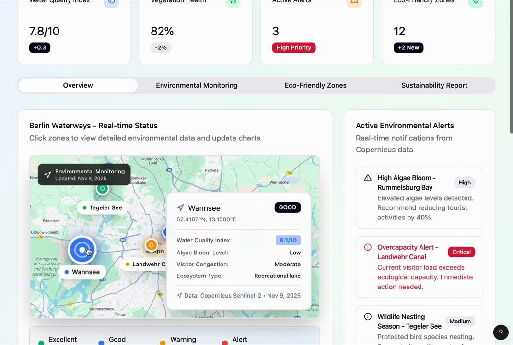

# Smart Waterways

<div align="center">
  
</div>

A comprehensive waterway monitoring and trip planning system for Berlin, combining an iOS mobile application with satellite-based water quality analysis and riparian vegetation monitoring.

## Overview

Smart Waterways is a multi-faceted project that enables users to plan waterway trips while providing scientific insights into water quality and ecosystem health through remote sensing data analysis. The project integrates:

- **iOS Mobile App**: Interactive trip planning for Berlin's waterways
- **Water Quality Monitoring**: Satellite-based analysis of water quality metrics
- **Vegetation Analysis**: Riparian zone vegetation health monitoring

## Components

### 1. iOS Application (WaterFlow Berlin)

An iOS application for planning and managing waterway trips in Berlin's rivers, lakes, and canals.

#### Features

- 🗺️ **Interactive Map Interface**: Tap on waterways to set start and end points for your trip
- 🚤 **Multiple Vessel Types**: Support for Motor Boats, Kayaks, and Stand-Up Paddleboards
- 💧 **Waterbody Validation**: Ensures selected points are on water (rivers, lakes, canals) before creating trips
- 🛣️ **Smart Route Planning**: Automatically generates waterway routes using MapKit and synthetic route generation
- 📍 **Trip Management**: Create, view, and delete trips with start/end points and timestamps
- 🎨 **Modern UI**: Built with SwiftUI featuring smooth animations and intuitive interactions

#### Demo & Screenshots

**App Demo Video:**
<div align="center">
  <video width="600" controls>
    <source src="app.MP4" type="video/mp4">
    Your browser does not support the video tag.
  </video>
</div>

**Dashboard View:**
<div align="center">
  
</div>

#### Requirements

- iOS 17.0 or later
- Xcode 15.0 or later
- Swift 5.0 or later

#### Installation

1. Install [XcodeGen](https://github.com/yonaskolb/XcodeGen):
   ```bash
   brew install xcodegen
   ```

2. Generate the Xcode project:
   ```bash
   cd app
   xcodegen generate
   open build-zone.xcodeproj
   ```

3. Build and run in Xcode (⌘R)

### 2. Water Quality Analysis (`mago_water_quality.ipynb`)

Satellite-based water quality monitoring using Sentinel-2 imagery and the MAGO (MAnaging water quality using GOvernment data) algorithm. This notebook implements a comprehensive water quality monitoring system that analyzes multiple water quality parameters from satellite imagery and validates them against ground truth measurements.

#### Overview

The notebook uses Sentinel-2 L2A satellite imagery to calculate 8 different water quality indices using spectral band ratios and established algorithms. It performs temporal analysis across multiple years and lakes, and validates predictions using official Berlin water quality monitoring data.

#### Water Quality Metrics Analyzed

The notebook calculates 8 indices simultaneously:

1. **Chl-a (Mishra 2012)**: Chlorophyll-a concentration using NDCI-based algorithm (mg/m³)
2. **Chl-a > 5 mg/m³ (Soria-Perpinyà 2021)**: High chlorophyll-a concentration algorithm
3. **Chl-a < 5 mg/m³ (Soria-Perpinyà 2021)**: Low chlorophyll-a concentration algorithm
4. **Cyanobacteria (Potes et al. 2018)**: Phycocyanin-based cyanobacteria detection (cells/mL)
5. **Phycocyanin (Soria-Perpinyà 2021)**: Phycocyanin concentration (mg/m³)
6. **Turbidity (Zhan et al. 2022)**: Water turbidity in NTU
7. **CDOM (Soria-Perpinyà 2021)**: Colored Dissolved Organic Matter (µg/L)
8. **TSS (Soria-Perpinyà 2021)**: Total Suspended Solids (mg/L)

#### Workflow

1. **Configuration Setup**:
   - Configure Sentinel Hub credentials for Copernicus Data Space Ecosystem
   - Define area of interest (AOI) bounding boxes for Berlin lakes
   - Set resolution (10m default) and time intervals

2. **Multi-Year Analysis (2017-2025)**:
   - Requests Sentinel-2 imagery for summer months (May-September) for each year
   - Calculates all 8 water quality indices using custom evalscript
   - Applies cloud masking and water body filtering (NDWI threshold)
   - Generates time-series plots showing trends across years
   - Normalizes metrics for comparison

3. **Single Summer Analysis (2025)**:
   - Divides summer into 10-day intervals
   - Analyzes temporal variation within a single season
   - Compares metrics across different time periods
   - Overlays temperature data from Meteostat API

4. **Multi-Lake Comparison**:
   - Analyzes multiple Berlin lakes simultaneously:
     - Müggelsee (primary focus)
     - Krumme Lanke / Schlachtensee
     - Other Berlin water bodies
   - Compares normalized metrics across lakes
   - Identifies lake-specific patterns

5. **Validation with Ground Truth**:
   - Downloads official water quality data from Berlin LAGESO
   - Parses measurements including:
     - E. coli (KBE/100ml)
     - Intestinal Enterococci (KBE/100ml)
     - Coliform bacteria (KBE/100ml)
     - Water clarity/Secchi depth (m)
     - Cyanobacteria chlorophyll-a (µg/L)
   - Aligns satellite-derived metrics with measurement dates
   - Uses Ridge regression to predict measured parameters from satellite metrics

6. **Predictive Modeling**:
   - Trains Ridge regression models on satellite metrics
   - Predicts water clarity, E. coli, and cyanobacteria levels
   - Validates predictions against actual measurements
   - Tests model generalization across different lakes

#### Key Features

- **Cloud Filtering**: Uses Scene Classification Layer (SCL) to filter clouds and shadows
- **Water Masking**: NDWI threshold to ensure only water pixels are analyzed
- **Spatial Aggregation**: Mean/median aggregation across water pixels
- **Temporal Interpolation**: Resamples to daily resolution for alignment with measurements
- **Normalization**: Normalizes metrics for cross-year and cross-lake comparison

#### Configuration Options

```python
# Area of Interest (Müggelsee example)
aoi_coords_wgs84 = [13.614979, 52.423674, 13.688364, 52.450779]

# Resolution in meters
resolution = 10  # Can be adjusted (lower = higher detail, larger files)

# Time intervals
summer_intervals = [("2017-05-01", "2017-09-01"), ...]  # Yearly
current_summer_intervals = [("2025-05-01", "2025-05-11"), ...]  # 10-day periods
```

#### Outputs Generated

- **Time-series plots**: Year-over-year trends for all metrics
- **Comparison plots**: Multi-lake comparisons with temperature overlay
- **Validation plots**: Predicted vs. measured water quality parameters
- **Animation**: MP4 video showing water quality changes over years (`muggelsee_water_quality_by_year.mp4`)
- **Prediction visualizations**: PNG files showing model predictions (`predicted_measurements_2025_summer.png`)

#### Data Sources

- **Sentinel-2 L2A**: Satellite imagery via Copernicus Data Space Ecosystem
- **Berlin LAGESO**: Official water quality measurements from [LAGESO](https://www.data.lageso.de/baden/)
- **Meteostat API**: Historical temperature data for Berlin

#### Dependencies

```python
sentinelhub>=3.11.3      # Sentinel Hub Python package
pandas>=2.0              # Data manipulation
numpy>=2.0               # Numerical operations
matplotlib                # Plotting
scikit-learn             # Ridge regression for predictions
meteostat                # Weather data API
seaborn                  # Enhanced visualization
scipy                    # Scientific computing
```

#### Setup Instructions

1. **Install Dependencies**:
   ```bash
   pip install sentinelhub pandas numpy matplotlib scikit-learn meteostat seaborn scipy
   ```

2. **Obtain Sentinel Hub Credentials**:
   - Register at [Copernicus Data Space Ecosystem](https://shapps.dataspace.copernicus.eu/dashboard/)
   - Create an OAuth Client in User Settings
   - Copy `client_id` and `client_secret`

3. **Configure Credentials**:
   - Run the credential configuration cell in the notebook
   - Credentials are saved to a profile named "cdse" for reuse

4. **Run Analysis**:
   - Execute cells sequentially
   - Adjust AOI coordinates and time intervals as needed
   - Results are displayed inline and saved as images/videos

#### Usage Example

```python
# Define area of interest
aoi_coords_wgs84 = [13.614979, 52.423674, 13.688364, 52.450779]

# Generate summer intervals for a year
summer_intervals = [gen_year_summer(2024)]  # May 1 - Sep 1

# Request data
request = SentinelHubRequest(
    evalscript=evalscript_all_metrics,
    input_data=[...],
    bbox=aoi_bbox,
    size=aoi_size,
    config=config
)

# Get results
response = request.get_data()
water_quality_data = response[0]["indices.tif"]  # Shape: [H, W, 8]
```

#### Algorithm References

- Mishra, S., et al. (2012). NDCI-based chlorophyll-a estimation
- Soria-Perpinyà, X., et al. (2021). Multiple water quality algorithms
- Potes, M., et al. (2018). Cyanobacteria detection
- Zhan, Y., et al. (2022). Turbidity estimation

### 3. Riparian Vegetation Analysis (`vegetation_reparian_zone.ipynb`)

Analysis of shoreline vegetation health using NDVI (Normalized Difference Vegetation Index) from Sentinel-2 satellite imagery. This notebook focuses on monitoring the health and extent of riparian (shoreline) vegetation around Berlin's water bodies, which is crucial for ecosystem health and water quality.

#### Overview

The notebook analyzes vegetation in a 50-meter buffer zone inland from water bodies, providing insights into riparian ecosystem health over time. Healthy riparian vegetation helps filter pollutants, prevent erosion, and support biodiversity.

#### Key Concepts

- **Riparian Zone**: The transition area between water and land, critical for ecosystem health
- **NDVI (Normalized Difference Vegetation Index)**: Spectral index measuring vegetation health
  - Formula: `NDVI = (NIR - Red) / (NIR + Red)`
  - Values range from -1 to 1, where >0.3 typically indicates healthy vegetation
- **Shoreline Buffer**: 50-meter zone measured inland from the water edge

#### Workflow

1. **Area Definition**:
   - Define bounding box for area of interest (Müggelsee region by default)
   - Set resolution (10m) and shoreline buffer width (50m)

2. **Water Body Identification**:
   - Request Sentinel-2 Scene Classification Layer (SCL) for summer months (May-August)
   - Extract water pixels (SCL class 6: "Water")
   - Create binary water mask

3. **Shoreline Delineation**:
   - Use distance transform to identify pixels within 50m of water
   - Create riparian zone mask (land pixels within buffer distance)
   - Apply morphological operations to smooth shoreline

4. **NDVI Calculation**:
   - Request Sentinel-2 Red (B04) and Near-Infrared (B08) bands
   - Calculate NDVI for each pixel: `(B08 - B04) / (B08 + B04)`
   - Mask to only riparian zone pixels
   - Filter out invalid values (NaN, clouds, shadows)

5. **Statistical Analysis**:
   - Calculate mean NDVI for each year
   - Compute standard deviation
   - Calculate 95% confidence intervals
   - Generate time-series visualizations

6. **Temporal Analysis**:
   - Process data for years 2017-2025
   - Aggregate across summer months (May-August) for each year
   - Track year-over-year changes in vegetation health

#### Methodology Details

**Shoreline Buffer Creation**:
```python
def shoreline_band_inland(water_mask, pixel_size_m, shore_width_m):
    """
    Creates a mask of land pixels within shore_width_m of water,
    measured inland from the water edge.
    """
    land = ~water_mask
    dist_to_water_m = distance_transform_edt(land, sampling=pixel_size_m)
    shore = land & (dist_to_water_m > 0) & (dist_to_water_m <= shore_width_m)
    return shore
```

**NDVI Calculation**:
- Uses Sentinel-2 bands B04 (Red) and B08 (NIR)
- Applies water mask and riparian zone mask
- Filters out clouds, shadows, and invalid pixels
- Aggregates statistics from valid pixels only

#### Configuration

```python
# Area of Interest (Müggelsee region)
AOI_COORDS_WGS84 = [13.552322, 52.399591, 13.799515, 52.485394]

# Resolution in meters
RESOLUTION = 10

# Shoreline buffer width in meters
SHORE_WIDTH = 50  # 50m inland from water edge

# Time period for analysis (summer months)
time_intervals = [
    ("2017-05-01T00:00:00Z", "2017-08-31T23:59:59Z"),
    # ... for each year 2017-2025
]
```

#### Outputs Generated

1. **Annual NDVI Maps**:
   - PNG images showing NDVI distribution for each year (`ndvi_2017.png`, etc.)
   - Color-coded visualization of vegetation health
   - Masked to show only riparian zones

2. **Time-Series Plots**:
   - Mean NDVI over time with confidence intervals
   - Standard deviation trends
   - Year-over-year comparison

3. **CSV Export** (`ndvi.csv`):
   ```csv
   years,mean,std,ci
   2017,0.523,0.142,0.008
   2018,0.531,0.145,0.009
   ...
   ```

4. **Statistical Summary**:
   - Mean NDVI per year
   - Standard deviation
   - 95% confidence intervals
   - Sample sizes (number of valid pixels)

#### Key Features

- **Cloud Filtering**: Uses SCL to exclude clouds, shadows, and invalid pixels
- **Precise Shoreline Detection**: Distance transform ensures accurate buffer zone
- **Temporal Consistency**: Uses same time period (summer months) for all years
- **Statistical Rigor**: Provides confidence intervals for trend analysis
- **Visualization**: Generates publication-ready plots and maps

#### Interpretation Guide

- **NDVI Values**:
  - **< 0**: Water, clouds, or no vegetation
  - **0.0 - 0.3**: Sparse or stressed vegetation
  - **0.3 - 0.6**: Moderate vegetation health
  - **> 0.6**: Dense, healthy vegetation

- **Trends**:
  - **Increasing NDVI**: Improving vegetation health (reforestation, restoration)
  - **Decreasing NDVI**: Declining health (drought, pollution, development)
  - **Stable NDVI**: Consistent ecosystem conditions

#### Data Sources

- **Sentinel-2 L2A**: Satellite imagery via Copernicus Data Space Ecosystem
- **Scene Classification Layer (SCL)**: Pixel-level classification for water/land/cloud detection

#### Dependencies

```python
sentinelhub>=3.11.3      # Sentinel Hub Python package
pandas>=2.0              # Data manipulation
numpy>=2.0               # Numerical operations
matplotlib               # Plotting
scipy                    # Distance transforms, image processing
seaborn                  # Enhanced visualization
```

#### Setup Instructions

1. **Install Dependencies**:
   ```bash
   pip install sentinelhub pandas numpy matplotlib scipy seaborn
   ```

2. **Configure Sentinel Hub**:
   - Same credentials setup as water quality notebook
   - Uses "cdse" profile if already configured

3. **Run Analysis**:
   - Execute cells sequentially
   - Adjust AOI coordinates and buffer width as needed
   - Results are saved as images and CSV

#### Usage Example

```python
# Define parameters
AOI_COORDS_WGS84 = [13.552322, 52.399591, 13.799515, 52.485394]
RESOLUTION = 10
SHORE_WIDTH = 50

# Request SCL for water detection
scl_request = SentinelHubRequest(
    evalscript=evalscript_scl,
    input_data=[...],
    bbox=aoi_bbox,
    size=aoi_size,
    config=config
)

# Create riparian mask
water_mask = (scl_data == 6)  # SCL class 6 = water
shore_mask = shoreline_band_inland(water_mask, RESOLUTION, SHORE_WIDTH)

# Calculate NDVI for riparian zone
ndvi_data = ndvi_request.get_data()[0]
ndvi_riparian = np.where(shore_mask, ndvi_data, np.nan)

# Calculate statistics
mean_ndvi = np.nanmean(ndvi_riparian)
std_ndvi = np.nanstd(ndvi_riparian)
```

#### Applications

- **Ecosystem Monitoring**: Track riparian health over time
- **Restoration Assessment**: Evaluate effectiveness of restoration projects
- **Water Quality Correlation**: Compare with water quality metrics
- **Climate Impact**: Assess effects of climate change on vegetation
- **Urban Planning**: Inform development decisions near water bodies

## Project Structure

```
Smart-Waterways/
├── app/                                    # iOS Application
│   ├── build-zone/
│   │   ├── Models/
│   │   │   └── Trip.swift                 # Trip data model
│   │   ├── Services/
│   │   │   ├── WaterbodyValidator.swift   # Water validation service
│   │   │   └── WaterRoutePlanner.swift    # Route planning service
│   │   ├── ViewModels/
│   │   │   └── TripViewModel.swift        # Trip management logic
│   │   ├── Views/
│   │   │   ├── HomeView.swift             # Main map interface
│   │   │   └── Components/                # UI components
│   │   └── WaterFlowBerlinApp.swift       # App entry point
│   └── project.yml                        # XcodeGen configuration
│
├── mago_water_quality.ipynb               # Water quality analysis notebook
├── vegetation_reparian_zone.ipynb         # Vegetation analysis notebook
│
├── muggelsee_water_quality_by_year.mp4   # Water quality animation
├── predicted_measurements_2025_summer.png # Prediction visualization
└── README.md                              # This file
```

## Architecture

### iOS App Architecture

The app follows a clean architecture pattern:

- **Models**: Data structures (`Trip`, `VesselType`)
- **Services**: Core business logic (`WaterbodyValidator`, `WaterRoutePlanner`)
- **ViewModels**: Presentation logic (`TripViewModel`)
- **Views**: SwiftUI user interface components

#### Key Components

- **WaterbodyValidator**: Uses MapKit POI search and reverse geocoding to validate coordinates are on water bodies. Includes caching and rate limiting for API calls.

- **WaterRoutePlanner**: Plans routes along waterways by:
  - Attempting to use MapKit directions
  - Falling back to synthetic route generation with natural curves
  - Validating route points are on water
  - Deduplicating and optimizing route coordinates

- **TripViewModel**: Manages trip state, handles user interactions, and coordinates between services and views.

## Usage

### iOS App

1. **Create a Trip**:
   - Tap the "+" button to start creating a new trip
   - Select your vessel type (Motor Boat, Kayak, or Stand-Up Paddle)
   - Tap on the map to set your start point (must be on water)
   - Tap again to set your end point
   - Tap "Create Trip" to generate the route

2. **View Trips**:
   - Tap the list icon to view all your trips
   - Select a trip to view its route on the map

3. **Delete Trips**:
   - Swipe left on a trip in the list to delete it

### Analysis Notebooks

#### Water Quality Analysis (`mago_water_quality.ipynb`)

1. **Initial Setup**:
   ```bash
   # Install required packages
   pip install sentinelhub pandas numpy matplotlib scikit-learn meteostat seaborn scipy
   ```

2. **Configure Credentials**:
   - Register at [Copernicus Data Space Ecosystem](https://shapps.dataspace.copernicus.eu/dashboard/)
   - Create OAuth Client and obtain `client_id` and `client_secret`
   - Run the credential configuration cell in the notebook
   - Credentials are saved to "cdse" profile for future use

3. **Configure Analysis Parameters**:
   - Set area of interest (AOI) coordinates for your target lake
   - Adjust resolution (default: 10m)
   - Define time intervals (yearly or seasonal)

4. **Run Analysis**:
   - Execute cells sequentially
   - For multi-year analysis: Run cells that process 2017-2025 data
   - For single summer: Run cells that analyze 10-day intervals
   - For validation: Run cells that download and compare with LAGESO data

5. **View Results**:
   - Time-series plots show trends over years
   - Comparison plots show multi-lake differences
   - Validation plots compare predictions with measurements
   - Animation video shows temporal changes

6. **Export Results**:
   - Plots are automatically saved as PNG files
   - Animation saved as MP4
   - Data can be exported to CSV for further analysis

#### Vegetation Analysis (`vegetation_reparian_zone.ipynb`)

1. **Initial Setup**:
   ```bash
   # Install required packages
   pip install sentinelhub pandas numpy matplotlib scipy seaborn
   ```

2. **Configure Credentials**:
   - Use same Sentinel Hub credentials as water quality notebook
   - If "cdse" profile exists, it will be reused automatically

3. **Configure Analysis Parameters**:
   - Set AOI coordinates (default: Müggelsee region)
   - Adjust resolution (default: 10m)
   - Set shoreline buffer width (default: 50m)
   - Define time periods for analysis (default: summer months)

4. **Run Analysis**:
   - Execute cells sequentially
   - The notebook processes each year from 2017-2025
   - For each year:
     - Requests SCL data for water detection
     - Creates riparian zone mask
     - Calculates NDVI
     - Generates visualization

5. **View Results**:
   - Annual NDVI maps show spatial distribution
   - Time-series plot shows trends with confidence intervals
   - Statistical summary provides mean, std, and CI values

6. **Export Results**:
   - NDVI maps saved as PNG files (`ndvi_YYYY.png`)
   - Statistics exported to CSV (`ndvi.csv`)
   - Plots can be saved for publications

## Technologies

### iOS App
- **SwiftUI**: Modern declarative UI framework
- **MapKit**: Map display and location services
- **CoreLocation**: Location and geocoding services
- **XcodeGen**: Project generation from YAML configuration

### Data Analysis
- **Sentinel Hub Python**: Access to Copernicus satellite data
- **Sentinel-2 L2A**: Satellite imagery for water quality and vegetation analysis
- **Python Scientific Stack**: pandas, numpy, matplotlib, scikit-learn
- **Jupyter Notebooks**: Interactive data analysis environment

## Data Sources

- **Copernicus Data Space Ecosystem**: Sentinel-2 satellite imagery
- **Berlin LAGESO**: Official water quality measurements
- **Meteostat**: Historical weather data
- **MapKit**: Map data and geocoding services

## Development

### iOS App

The project uses XcodeGen for project configuration. To modify project settings, edit `app/project.yml` and regenerate the project.

### Notebooks

Both notebooks require Sentinel Hub credentials. See the notebooks for detailed setup instructions.

## Research Applications

This project demonstrates:

- **Remote Sensing for Water Quality**: Using satellite imagery to monitor water quality parameters
- **Machine Learning for Prediction**: Predicting water quality metrics from satellite data
- **Ecosystem Monitoring**: Tracking riparian vegetation health over time
- **Mobile Integration**: Combining scientific data with practical trip planning tools

## Future Enhancements

- Integration of water quality data into the iOS app
- Real-time water quality alerts
- Historical water quality visualization in trip planning
- Expanded analysis to more Berlin water bodies
- User-contributed water quality observations


## Acknowledgments

- Copernicus Data Space Ecosystem for satellite imagery
- Berlin LAGESO for water quality monitoring data
- Sentinel Hub for data access infrastructure
